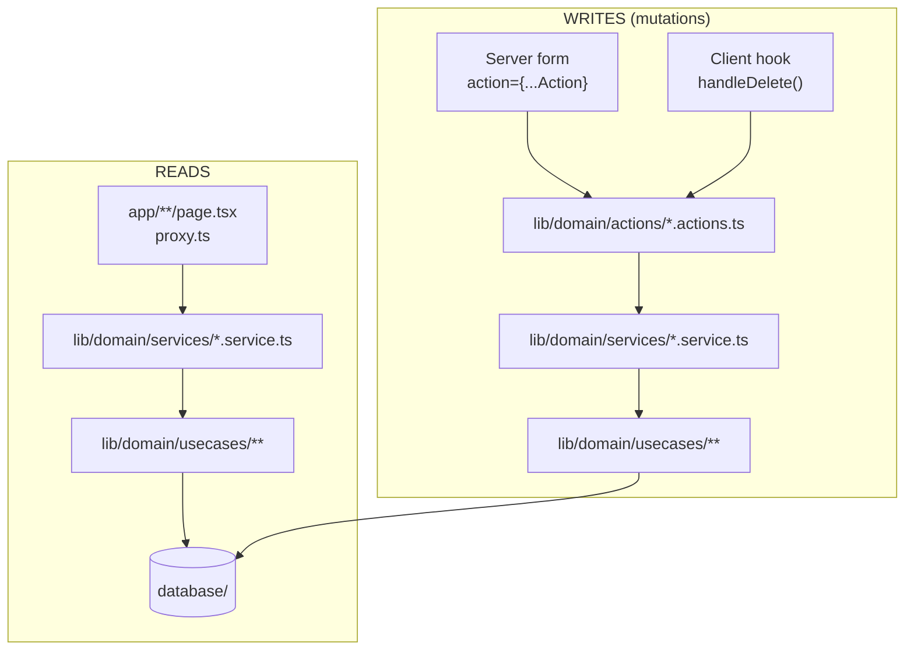
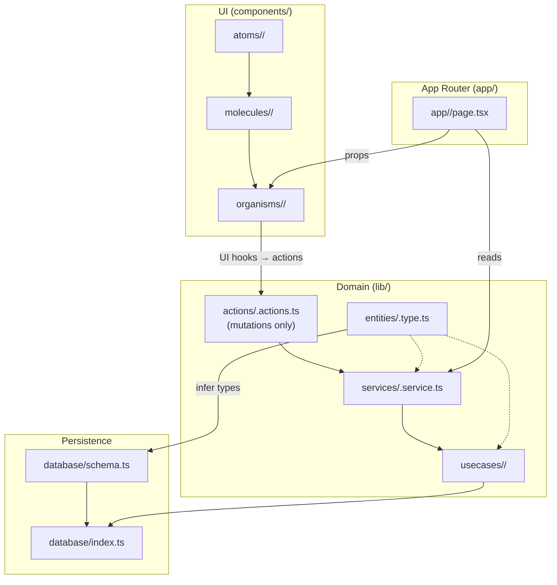
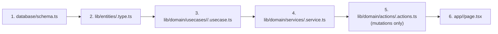

# Project architecture

This document describes how **rnd-nextjs-template** is structured: runtime stack, dependencies, the Next.js App Router and `components` layout (frontend), and the domain-oriented layout under `lib` plus persistence (`database/`) used by server code.

**Representative code samples** for each layer appear in [Full code samples by folder](#full-code-samples-by-folder).

---

## Stack

| Layer | Technology | Notes |
|--------|------------|--------|
| Framework | **Next.js 16** (`16.2.4`) | App Router; RSC by default; Cache Components via `"use cache"` in use cases |
| UI | **React 19** (`19.2.4`) | Client components opt in with `"use client"` |
| Language | **TypeScript 5** | Strict typing; path alias `@/` (see `tsconfig.json`) |
| Styling | **Tailwind CSS 4** | PostCSS via `@tailwindcss/postcss` |
| Auth | **Better Auth** (`^1.6.23`) | Server-side only via `auth.api.*` in use cases; Drizzle adapter |
| Database access | **Drizzle ORM** (`0.45.2`) | Schema in `database/schema.ts`; MySQL dialect |
| DB driver | **mysql2** (`3.22.5`) | Connection pool in `database/index.ts` |
| Env | **dotenv** (`^17.4.2`) | Loaded in `database/index.ts` for local credentials |
| Linting | **ESLint 9** + **eslint-config-next** (`16.2.4`) | Aligned with Next.js major version |

---

## Dependencies

### Runtime (`dependencies`)

| Package | Version (range) | Role in this project |
|---------|-----------------|----------------------|
| `next` | `16.2.4` | Application framework, routing, RSC, Cache Components |
| `react` | `19.2.4` | UI runtime |
| `react-dom` | `19.2.4` | DOM rendering |
| `better-auth` | `^1.6.23` | Email/password auth; session cookies via `nextCookies()` plugin |
| `drizzle-orm` | `^0.45.2` | Type-safe SQL / schema; used in use cases |
| `mysql2` | `^3.22.5` | MySQL connection pool for Drizzle |
| `dotenv` | `^17.4.2` | Loads `DATABASE_URL` (and similar) for DB bootstrap |

### Development (`devDependencies`)

| Package | Version (range) | Role |
|---------|-----------------|------|
| `typescript` | `^5` | Type checking |
| `@types/node` | `^20.19.43` | Node.js types |
| `@types/react` | `^19` | React types |
| `@types/react-dom` | `^19` | React DOM types |
| `tailwindcss` | `^4` | Utility-first CSS |
| `@tailwindcss/postcss` | `^4` | Tailwind PostCSS integration |
| `eslint` | `^9` | Lint runner |
| `eslint-config-next` | `16.2.4` | Next.js ESLint preset |
| `drizzle-kit` | `^0.31.10` | Migrations / Drizzle CLI (`drizzle.config.ts`) |

### npm scripts (database)

| Script | Command | Purpose |
|--------|---------|---------|
| `db:generate` | `drizzle-kit generate` | Generate migration SQL from schema changes |
| `db:migrate` | `bun scripts/migrate.mts` | Run migrations programmatically (shows errors clearly) |
| `db:push` | `drizzle-kit push` | Push schema directly (dev only) |
| `db:studio` | `drizzle-kit studio` | Open Drizzle Studio |

---

## Repository layout (high level)

```
rnd-nextjs-template/
├── app/                    # Next.js App Router: pages, layout, global styles
├── components/             # UI: atomic design (atoms → molecules → organisms)
├── lib/
│   ├── domain/
│   │   ├── actions/        # Server Actions — mutations only ("use server")
│   │   ├── services/       # Orchestration — reads + write delegation
│   │   └── usecases/       # Single-purpose DB / auth operations
│   └── entities/           # Domain types inferred from schema
├── database/               # Drizzle client + schema
├── auth.ts                 # Better Auth config (Drizzle adapter + nextCookies)
├── proxy.ts                # Route protection (session guard)
├── scripts/
│   └── migrate.mts         # Programmatic migration runner
├── drizzle.config.ts
├── next.config.ts
├── package.json
└── tsconfig.json
```

**There are no controllers.** Pages, proxy, and forms import **services** (reads) or **actions** (mutations) directly.

---

## Domain layer — request flow

### Reads vs writes



| Call type | Entry point | Next layer | Example |
|-----------|-------------|------------|---------|
| **Read** | Page, `proxy.ts` | `*.service.ts` → use case | `getUsers()` in `app/users/page.tsx` |
| **Write** | Form / UI hook | `*.actions.ts` → service → use case | `deleteUserAction` → `deleteUser()` |

### `lib/domain/actions/` — mutations only

- Files are marked `"use server"`.
- Parse `FormData`, call the matching **service** function, handle `redirect()` / error query params.
- Imported directly by server forms (`action={signInAction}`) or by **UI hooks** on the client (`handleDelete` → `deleteUserAction`).
- **No route-level `app/**/actions.ts`** — actions live in `lib/domain/actions/<table>.actions.ts`.

| File | Exports |
|------|---------|
| `auth.actions.ts` | `signInAction`, `signUpAction`, `signOutAction` |
| `users.actions.ts` | `deleteUserAction` |

### `lib/domain/services/` — orchestration

- Compose use cases; no `"use server"`.
- **Pages and proxy import services for reads.**
- **Actions import services for writes.**

| File | Reads | Writes |
|------|-------|--------|
| `auth.service.ts` | `getSession`, `getSessionFromHeaders` | `signIn`, `signUp`, `signOut` |
| `users.service.ts` | `getUsers`, `getTeacherUsers` | `deleteUser` |

### `lib/domain/usecases/` — one operation per file

- DB access via `@/database` and `@/database/schema`.
- Auth use cases call `auth.api.*` from `@/auth` (Better Auth).
- Reads use `"use cache"`, `cacheLife`, `cacheTag`.
- Writes call `updateTag("<table>")` after mutations.

### `lib/entities/` — shared types

- Types inferred from Drizzle exports (`UserSelect`, etc.).
- Result wrappers: `AuthResult`, `UserResult`.
- Constants: `USER_ROLE`.

---

## Auth

### Better Auth (`auth.ts`)

- Drizzle adapter wired to `database/schema.ts` (`user`, `session`, `account`, `verification`).
- Email/password enabled.
- `nextCookies()` plugin sets session cookies on the server.

### Environment

| Variable | Purpose |
|----------|---------|
| `DATABASE_URL` | MySQL connection string (use a dedicated app DB, e.g. `rnd_template`) |
| `BETTER_AUTH_SECRET` | Signing secret |
| `BETTER_AUTH_URL` | Base URL (e.g. `http://localhost:3000`) |

### Route protection (`proxy.ts`)

- Reads session via `getSessionFromHeaders()` from `auth.service`.
- Public paths: `/sign-in`, `/sign-up`, `/api/auth`.
- Unauthenticated → redirect to `/sign-in?callbackURL=...`.
- Authenticated on auth pages → redirect to `/`.

### Auth UI

| Route | Component | Pattern |
|-------|-----------|---------|
| `/sign-in` | `SignInForm` | Server form → `signInAction` |
| `/sign-up` | `SignUpForm` | Server form → `signUpAction` |
| `/` | Home | `signOutAction` when session exists |

No client-side auth SDK. All auth goes through server actions and `auth.api` in use cases.

---

## Next.js frontend structure (`app/` + `components/`)

### `app/` — App Router

| Path | Responsibility |
|------|----------------|
| `app/layout.tsx` | Root layout: fonts (Geist), `globals.css`, HTML shell |
| `app/page.tsx` | Home; session display; links to users; `signOutAction` form |
| `app/sign-in/page.tsx` | Suspense wrapper → `SignInForm` organism |
| `app/sign-up/page.tsx` | Suspense wrapper → `SignUpForm` organism |
| `app/users/page.tsx` | `getUsers()` from service → `UsersTable` |
| `app/users/teachers/page.tsx` | `getTeacherUsers()` from service → `UsersTable` |
| `app/globals.css` | Global styles (Tailwind entry) |

**Pattern:** Server Components call **services** for data. Interactive UI lives in client components under `components/`. Mutations go through **actions** (server) or **UI hooks** (client handlers that call actions).

### `components/` — Atomic design

Brad Frost–style layers. **Every component folder co-locates a hooks file:**

```
components/atoms/Button/
  Button.tsx
  button.hooks.ts

components/molecules/UserCard/
  UserCard.tsx
  userCard.hooks.ts

components/organisms/UsersTable/
  UsersTable.tsx
  usersTable.hooks.ts
```

**Naming:** `<camelCaseComponentName>.hooks.ts` in the **same folder** as the component. No layer suffix in the filename — the folder path (`atoms/`, `molecules/`, `organisms/`) already indicates the layer.

| Layer | Path | Examples |
|-------|------|----------|
| **Atoms** | `components/atoms/<Name>/` | `Button/`, `Label/`, `Input/` |
| **Molecules** | `components/molecules/<Name>/` | `UserCard/`, `LabelInput/` |
| **Organisms** | `components/organisms/<Name>/` | `UsersTable/`, `SignInForm/`, `SignUpForm/`, `AuthShell/` |

### Actions vs UI hooks

| Concern | Location | Role |
|---------|----------|------|
| **Server mutations** | `lib/domain/actions/*.actions.ts` | `"use server"`; parse FormData; redirect |
| **UI mutation handlers** | `<component>.hooks.ts` next to the component | `handleDelete`, `handleRefresh`; call server actions from client |

**Server forms** (auth): field configs in organism hooks → render `LabelInput` molecules → `action={signInAction}` on `<form>`.

**Client components** (delete user): `UserCard.tsx` calls `handleDelete` from `userCard.hooks.ts`, which builds `FormData` and invokes `deleteUserAction`.

### Conventions

- **Client boundaries:** Components that use React state/events or call UI mutation hooks use `"use client"` (e.g. `UsersTable`, `UserCard`).
- **Data from server:** Pages pass serializable props into organisms.
- **Imports:** UI types from `@/lib/entities/...`. UI must **not** import `database/` or use cases directly.
- **Forms:** Use `LabelInput` molecule + `Button` atom. Field definitions live in organism hooks (`signInForm.hooks.ts` exports `fields: LabelInputField[]`).

---

## Workflows — per `table_name`

Each database table gets its own vertical slice in `lib/`. Folder and file names match the **Drizzle table export** (e.g. `user` → `users.type.ts`, `users.service.ts`, `usecases/users/`). The **user** table (Better Auth) is the reference implementation.

**Placeholder:** `<table_name>` = table export in `database/schema.ts` (e.g. `user`, `session`).

### End-to-end overview



### 1. Add a new table (server data)



| Step | Path | What to do |
|------|------|------------|
| 1 | `database/schema.ts` | Add table. Run `npm run db:generate` + `npm run db:migrate`. |
| 2 | `lib/entities/<table>.type.ts` | `$inferSelect`, `$inferInsert`, result types, constants. |
| 3 | `lib/domain/usecases/<table>/` | One file per operation. Reads: `"use cache"`. Writes: `updateTag`. |
| 4 | `lib/domain/services/<table>.service.ts` | Compose use cases. |
| 5 | `lib/domain/actions/<table>.actions.ts` | `"use server"` mutation entry points (if writes exist). |
| 6 | Consumer | Page imports **service** for reads; forms/hooks import **actions** for writes. |

**Example (`user` table):**

| Layer | Path |
|-------|------|
| Schema | `database/schema.ts` → `user`, `session`, `account`, `verification` |
| Entity | `lib/entities/users.type.ts` |
| Use cases | `get_users.usecase.ts`, `get_users_by_role.usecase.ts`, `delete_user.usecase.ts` |
| Service | `lib/domain/services/users.service.ts` |
| Actions | `lib/domain/actions/users.actions.ts` → `deleteUserAction` |
| Pages | `app/users/page.tsx`, `app/users/teachers/page.tsx` |
| UI | `UserCard` (delete), `UsersTable` (list) |

### 2. Add UI for a table

| Layer | Path pattern | Example |
|-------|--------------|---------|
| **Atom** | `components/atoms/<Name>/` | `Button/`, `Input/`, `Label/` |
| **Molecule** | `components/molecules/<Name>/` | `UserCard/`, `LabelInput/` |
| **Organism** | `components/organisms/<Name>/` | `UsersTable/`, `SignInForm/` |

Each folder: `<Name>.tsx` + `<camelCaseName>.hooks.ts`.

For **forms**: define `LabelInputField[]` in organism hooks; map to `<LabelInput />`; wire `action={...Action}` on `<form>`.

For **client mutations**: implement `handleX` in molecule/organism hooks; call the server action inside.

### 3. Add a page for a table

| Step | Action |
|------|--------|
| 1 | Create `app/<route>/page.tsx` (Server Component). |
| 2 | Import read function from `@/lib/domain/services/<table>.service`. |
| 3 | `await` the service in the page. |
| 4 | Render organism with typed props. |
| 5 | Pass `error` from `searchParams` when actions redirect with `?error=`. |

### 4. HTTP API route (optional)

Route handlers may import **services** (reads) or **actions** / services (writes). Never query `database` directly in `route.ts`.

### Quick reference checklist

| Step | Path |
|------|------|
| Define table | `database/schema.ts` |
| Types | `lib/entities/<table>.type.ts` |
| DB operations | `lib/domain/usecases/<table>/<action>.usecase.ts` |
| Orchestration | `lib/domain/services/<table>.service.ts` |
| Mutations | `lib/domain/actions/<table>.actions.ts` |
| Screen | `app/<route>/page.tsx` (reads via service) |
| Row/card UI | `components/molecules/<Name>/` |
| List/form UI | `components/organisms/<Name>/` |
| Shared controls | `components/atoms/<Name>/` |

---

## Full code samples by folder

Representative current sources. Static assets in `public/` are omitted.

### `app/users/page.tsx`

```tsx
import { getUsers } from "@/lib/domain/services/users.service";
import { UsersTable } from "@/components/organisms/UsersTable/UsersTable";

type UsersPageProps = {
  searchParams: Promise<{ error?: string }>;
};

export default async function UsersPage({ searchParams }: UsersPageProps) {
  const users = await getUsers();
  const params = await searchParams;

  return (
    <main className="max-w-4xl mx-auto py-12 px-6">
      <h1 className="text-3xl font-bold mb-8">Users</h1>
      <UsersTable users={users} redirectTo="/users" error={params.error} />
    </main>
  );
}
```

### `components/atoms/Button/Button.tsx`

```tsx
import React from "react";
import { useButtonStyles } from "./button.hooks";

interface Props {
  children: React.ReactNode;
  variant?: "primary" | "secondary" | "danger" | "success";
  type?: "button" | "submit" | "reset";
  className?: string;
  onClick?: () => void;
  disabled?: boolean;
}

export const Button: React.FC<Props> = ({
  children,
  variant = "primary",
  type = "button",
  className,
  onClick,
  disabled,
}) => {
  const styles = [useButtonStyles(variant), className].filter(Boolean).join(" ");
  return (
    <button type={type} className={styles} onClick={onClick} disabled={disabled}>
      {children}
    </button>
  );
};
```

### `components/molecules/LabelInput/LabelInput.tsx`

```tsx
import { Label } from "@/components/atoms/Label/Label";
import { Input } from "@/components/atoms/Input/Input";
import { useLabelInputStyles, type LabelInputField } from "./labelInput.hooks";

type LabelInputProps = LabelInputField;

export function LabelInput({
  label,
  name,
  type = "text",
  placeholder,
  autoComplete,
  required,
  minLength,
}: LabelInputProps) {
  const className = useLabelInputStyles();

  return (
    <label className={className} htmlFor={name}>
      <Label>{label}</Label>
      <Input
        id={name}
        name={name}
        type={type}
        placeholder={placeholder}
        autoComplete={autoComplete}
        required={required}
        minLength={minLength}
      />
    </label>
  );
}
```

### `components/molecules/UserCard/userCard.hooks.ts`

```ts
import { deleteUserAction } from "@/lib/domain/actions/users.actions";

export const useUserCard = (redirectTo = "/users") => {
  const handleDelete = async (id: string) => {
    const formData = new FormData();
    formData.set("id", id);
    formData.set("redirectTo", redirectTo);
    await deleteUserAction(formData);
  };

  return { handleDelete };
};
```

### `components/molecules/UserCard/UserCard.tsx`

```tsx
"use client";

import { Button } from "@/components/atoms/Button/Button";
import { useUserCard } from "./userCard.hooks";
import type { UserSelect } from "@/lib/entities/users.type";

interface UserCardProps {
  user: UserSelect;
  redirectTo?: string;
}

export const UserCard = ({ user, redirectTo = "/users" }: UserCardProps) => {
  const { handleDelete } = useUserCard(redirectTo);

  return (
    <div className="flex justify-between items-center p-4 border rounded-lg shadow-sm bg-white dark:bg-zinc-900 dark:border-zinc-800">
      <div>
        <h2 className="text-lg font-semibold">{user.name}</h2>
        <p className="text-sm text-gray-500">{user.email}</p>
      </div>
      <Button onClick={() => handleDelete(user.id)} variant="danger">
        Delete
      </Button>
    </div>
  );
};
```

### `components/organisms/SignInForm/sign-in-form.tsx`

```tsx
import { redirect } from "next/navigation";
import { signInAction } from "@/lib/domain/actions/auth.actions";
import { getSession } from "@/lib/domain/services/auth.service";
import { AuthShell } from "@/components/organisms/AuthShell/AuthShell";
import { LabelInput } from "@/components/molecules/LabelInput/LabelInput";
import { Button } from "@/components/atoms/Button/Button";
import { useAuthFormSubmitStyles } from "@/components/atoms/Button/button.hooks";
import { getSignInFormState } from "./signInForm.hooks";

export async function SignInForm({ searchParams }: { searchParams: Promise<{ error?: string; callbackURL?: string }> }) {
  const session = await getSession();
  const params = await searchParams;
  if (session) redirect(params.callbackURL || "/");

  const { callbackURL, error, fields } = getSignInFormState(params);
  const submitClassName = useAuthFormSubmitStyles();

  return (
    <AuthShell title="Sign in" description="Use your email and password to continue.">
      {error ? <p className="mb-6 ...">{error}</p> : null}
      <form action={signInAction} className="space-y-5">
        <input type="hidden" name="callbackURL" value={callbackURL} />
        {fields.map((field) => (
          <LabelInput key={field.name} {...field} />
        ))}
        <Button type="submit" className={submitClassName}>Sign in</Button>
      </form>
    </AuthShell>
  );
}
```

### `lib/domain/actions/users.actions.ts`

```ts
"use server";

import { redirect } from "next/navigation";
import { deleteUser } from "@/lib/domain/services/users.service";

export async function deleteUserAction(formData: FormData) {
  const id = String(formData.get("id") ?? "").trim();
  const redirectTo = String(formData.get("redirectTo") ?? "").trim() || "/users";

  if (!id) {
    redirect(`${redirectTo}?error=${encodeURIComponent("User id is required")}`);
  }

  const result = await deleteUser({ id });
  if (!result.ok) {
    redirect(`${redirectTo}?error=${encodeURIComponent(result.error)}`);
  }
  redirect(redirectTo);
}
```

### `lib/domain/services/users.service.ts`

```ts
import { getUsers as getUsersUseCase } from "../usecases/users/get_users.usecase";
import { getUsersByRole } from "../usecases/users/get_users_by_role.usecase";
import { deleteUser as deleteUserUseCase } from "../usecases/users/delete_user.usecase";
import { USER_ROLE, type DeleteUserInput, type UserResult, type UserSelect } from "@/lib/entities/users.type";

export async function getUsers(): Promise<UserSelect[]> {
  return getUsersUseCase();
}

export async function getTeacherUsers(): Promise<UserSelect[]> {
  return getUsersByRole(USER_ROLE.TEACHER);
}

export async function deleteUser(input: DeleteUserInput): Promise<UserResult> {
  return deleteUserUseCase(input);
}
```

### `lib/domain/usecases/users/delete_user.usecase.ts`

```ts
import { eq } from "drizzle-orm";
import { updateTag } from "next/cache";
import { database } from "@/database";
import { user } from "@/database/schema";
import type { DeleteUserInput, UserResult } from "@/lib/entities/users.type";

export async function deleteUser(input: DeleteUserInput): Promise<UserResult> {
  try {
    await database.delete(user).where(eq(user.id, input.id));
    updateTag("users");
    return { ok: true, data: undefined };
  } catch (error) {
    return { ok: false, error: error instanceof Error ? error.message : "Failed to delete user." };
  }
}
```

### `lib/entities/users.type.ts`

```ts
import { user } from "@/database/schema";

export type UserSelect = typeof user.$inferSelect;
export type UserInsert = typeof user.$inferInsert;

export const USER_ROLE = {
  TEACHER: "teacher",
  STUDENT: "student",
  ADMIN: "admin",
} as const;

export type UserRole = (typeof USER_ROLE)[keyof typeof USER_ROLE];

export type UserResult<T = void> =
  | { ok: true; data: T }
  | { ok: false; error: string };

export type DeleteUserInput = { id: string };
```

### `database/index.ts`

```ts
import "dotenv/config";
import { drizzle } from "drizzle-orm/mysql2";
import mysql from "mysql2/promise";

const pool = mysql.createPool({
  uri: process.env.DATABASE_URL,
  connectionLimit: 10,
  enableKeepAlive: true,
});

export const database = drizzle(pool);
```

### `database/schema.ts` (Better Auth tables — excerpt)

```ts
export const user = mysqlTable("user", {
  id: varchar("id", { length: 36 }).primaryKey(),
  name: varchar("name", { length: 255 }).notNull(),
  email: varchar("email", { length: 255 }).notNull().unique(),
  emailVerified: boolean("email_verified").default(false).notNull(),
  image: text("image"),
  createdAt: timestamp("created_at", { fsp: 3 }).defaultNow().notNull(),
  updatedAt: timestamp("updated_at", { fsp: 3 }).defaultNow().$onUpdate(() => new Date()).notNull(),
});

// session, account, verification — see database/schema.ts
```

### `proxy.ts`

```ts
import { NextRequest, NextResponse } from "next/server";
import { getSessionFromHeaders } from "@/lib/domain/services/auth.service";

export async function proxy(request: NextRequest) {
  const { pathname } = request.nextUrl;
  if (pathname.startsWith("/api/auth")) return NextResponse.next();

  const session = await getSessionFromHeaders(request.headers);
  const publicPaths = ["/sign-in", "/sign-up"];

  if (session && publicPaths.includes(pathname)) {
    return NextResponse.redirect(new URL("/", request.url));
  }
  if (!session && !publicPaths.includes(pathname)) {
    const signInUrl = new URL("/sign-in", request.url);
    signInUrl.searchParams.set("callbackURL", pathname);
    return NextResponse.redirect(signInUrl);
  }
  return NextResponse.next();
}
```

### `package.json` (scripts + auth dependency)

```json
{
  "scripts": {
    "dev": "next dev",
    "build": "next build",
    "start": "next start",
    "lint": "eslint",
    "db:generate": "drizzle-kit generate",
    "db:migrate": "bun scripts/migrate.mts",
    "db:push": "drizzle-kit push",
    "db:studio": "drizzle-kit studio"
  },
  "dependencies": {
    "better-auth": "^1.6.23",
    "drizzle-orm": "^0.45.2",
    "mysql2": "^3.22.5",
    "next": "16.2.4",
    "react": "19.2.4",
    "react-dom": "19.2.4"
  }
}
```

---

## Cross-cutting concerns

- **Environment:** `DATABASE_URL`, `BETTER_AUTH_SECRET`, `BETTER_AUTH_URL` required for auth and DB.
- **Path alias:** `@/` maps to the project root.
- **Separation:** UI depends on **entity types** only. Data access stays in use cases. **Reads** enter via services; **writes** enter via actions.
- **Hooks vs actions:** Server mutations live in `lib/domain/actions/`. UI-side handlers live in co-located `<name>.hooks.ts` next to the component.
- **Caching:** Use cases use `"use cache"`, `cacheLife("hours")`, `cacheTag("users")`. Mutations call `updateTag("users")`.
- **No client auth SDK:** Forms and hooks invoke server actions; use cases call `auth.api.*`.
- **Suspense:** Auth pages wrap async organisms in `<Suspense>` for `searchParams` / session reads.

---

## Version reference

Versions match **`package.json`** at the time this document was written. Reconcile after upgrades.
